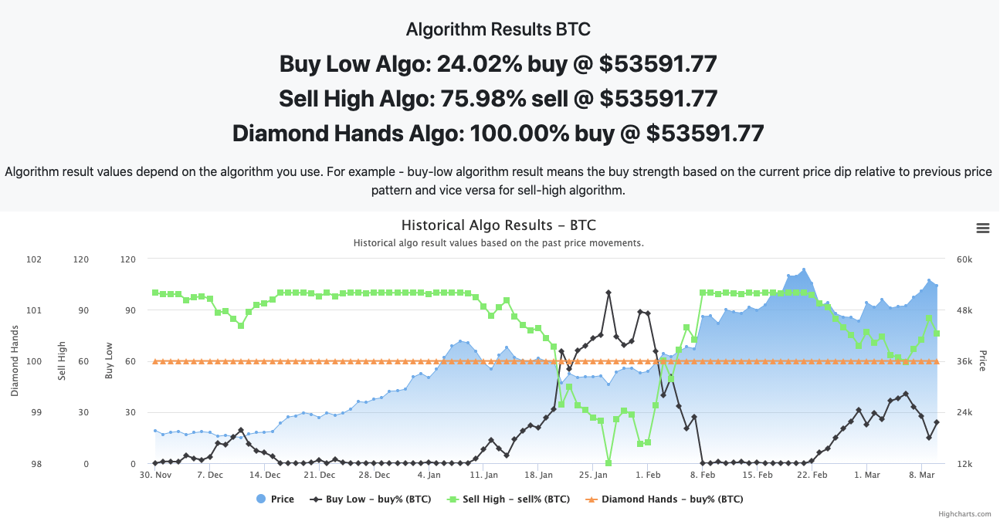

# TradingBot Typescript 

This is an autonomous trading bot in Typescript with web access! It allows users to run algorithms and create and deploy new algorithms very quickly and easily. It allows paper trading as well as live trading (live pending approval).

It is just the beginning but my vision for this repo is as follows:

# See it in action - https://tradingbotx.com

# Vision

- Build a community driven strong open source algorithm base in Typescript for trading efficiently
- Make these available to users for free forever so anyone can benefit from these algorithms
- Take a list of ticker symbols and algorithm(s), and find the best deals in the market from within that list.
- Able to schedule algorithms based on user's preference
- Provide a rating mechanism for Algorithms, so users can see the popular/highly rated algorithms
- Seamlessly integrate with all popular brokerages and crypto exchanges

Let's see how it goes! It's only the start.

# Roadmap

- [x] 🧹 Rewrite the project in typescript
- [x] 🆕 ✨ OAuth Support (https://alpaca.markets/docs/build-apps_services-with-alpaca/oauth-guide/)
- [x] 🆕 ✨ Trade with watchlists
- [x] 🆕 ✨ Watchlist
- [x] 🆕 ✨ SSL
- [x] 🧹 Transaction Type in the Trade Table
- [x] 🆕 ✨ Premium API support
- [x] 🧹 Skip orders that are not tradable fractionally
- [x] 🆕 ✨ Responsive Trade table for mobile
- [x] 🧹 Fix list selector styling on the trading page
- [x] 🆕 ✨ Support for live account (https://alpaca.markets/docs/api-documentation/api-v2/#paper-trading) - not exposed to public yet
- [x] 🧹 Error handling layer for both sync & async
- [x] 🐛 Timezone fix (changed to EST)
- [x] 🆕 ✨ Intraday price support for stocks (confidence is now realtime)
- [x] 🧹 Generic Algo Execution interfaces
- [x] 🆕 ✨ Multiple Algo Support - Buy & Sell basic
- [x] 🧹 README documentation for open sources, code clean up etc.
- [x] 🆕 ✨ Basic Backtest feature - allows you to look up algorithm's output b/w any timeframe
- [x] 🆕 ✨ Dark Mode Toggle 😍 
- [x] 🐛 Fix algo selection based on query params on Quick Analysis page
- [x] 🆕 ✨ Algorithms page to describe what each algorithm does
- [x] 🆕 ✨ Account's page
- [x] 🆕 ✨ Account's positions page
- [x] 🆕 ✨ List Orders page
- [x] 🆕 ✨ Cloud based trade schedule
- [x] 🆕 ✨ Advanced Backtest feature - allows you to simulate the trading using multiple algorithms on a list of stocks
- [ ] 🚧 API key/secret input for trade schedule
- [ ] Strong Validations (https://wanago.io/2018/12/17/typescript-express-error-handling-validation/)
- [ ] Generic algorithm parameters support
- [ ] Expose a mechanism to configure algorithms from the interface
- [ ] Expose API based live money trading for people who are looking to live trade (since OAuth isn't available for live trading yet)
- [ ] Live money trading approval by Alpaca
- [ ] Delete watchlist support
- [ ] Watchlist detail page
- [ ] Trade link on watchlist page
- [ ] Cancel Order
- [ ] Update Order

# Contribution

After you fork and checkout the repo in your local box:

```
npm install
npm run compile
```

To start the website, you'll need a couple of APIs:

1. Get AlphaVantage Free API [here](https://www.alphavantage.co/). AlphaVantage is used to pull historical Stock Prices data. We use OAuth, so you'll need to get the clientId and secret from the Alpaca's account dashboard.
2. (optional) Get Alpaca Free API [here](https://alpaca.markets/). Alpaca is used as a brokerage to make trades, manage watchlists etc for Stocks.
3. (optional) Get Free Crypto Compare API [here](https://min-api.cryptocompare.com/). Crypto Compare API is used to pull price information for Cryptos.

Once you have these, you can follow next steps to get up and running locally:

You need to set following environment variables. You can do so by creating a `.env` file in the root folder of this project locally and copy pasting the following in it:

```sh
# AlphaVantage - API KEY (need for Stock's historical prices)
AV_API_KEY=<your-alphavantage-key>

# (optional) Crypto Compare Key (only needed for Crypto history prices)
CRYPTO_API_KEY=<your-crypto-compare-key>

# (optional) Alpaca Configuration
# Note: You only need these if you're planning to
# 1. Make Trades from local
# 2. Manage/view watchlists
# OAuth Configuration
# Guide: https://alpaca.markets/docs/build-apps_services-with-alpaca/oauth-guide/
ALP_CLIENT_ID=<your-alpaca-client-id>
ALP_CLIENT_SECRET=<your-alpaca-client-secret>
# for oauth redirect, you can use the staging end point
ALP_REDIRECT_URI=<redirect-uri>
# (optional) You can also hardcode your personal access token for local development
ALP_HARDCODED_ACCESS_TOKEN=...

# Server Configuration
ENV=dev
PORT=3000
```

and then, simply:

```
npm start
```

Hit http://localhost:3000/ from your browser.

## Creating and deploying a new algorithm

First we need to understand the how algorithms are represented in this repo and their interfaces.

### Understanding Algorithm Interface

An Algorithm in this repo has an input and an output. The input takes an object that contains prices as timeseries. You don't need to worry about pulling prices from an API yourself, it comes out of the box for you!

```ts
export interface AlgoInput {
  prices: number[];
}
```

The output of an Algo is a timeseries list of indicator values predicted/calculated by the algo. This is because some algorithms might output more than one indicators.

```ts
export interface AlgoOutput {
  indicators: number[][]; // [0][1] means 0th indicator's 1st timestamp value
}
```

And lastly, algorithms have an `actionType` i.e. whether it is predicting a `buy` action or a `sell` action for the users. Algorithms also have a name and unique id. Name will be visible on the website. Here's how to implement a very basic algorithm:

### Create Algorithm

Let's create a Diamond Hands algorithm which returns 100% buy confidence always. :) Create `diamond-hands.ts` file in the `./src/algo` folder and then copy paste the code below:

```ts
import {Algo, AlgoInput, AlgoOutput, AlgoActionType} from './algo';

export class DiamondHandsAlgo implements Algo {
  async run(algoInput: AlgoInput): Promise<AlgoOutput> {
    // This algo always recommends 100% buy confidence :)
    const indicatorA = algoInput.prices.map(p => 100);
    return {
      indicators: [indicatorA],
    };
  }

  actionType(): AlgoActionType {
    return 'buy';
  }

  name() {
    return 'Diamond Hands';
  }

  id() {
    return 'DiamondHands';
  }
}
```

Last thing we need to do is to add this algo in the registry `./src/algo/algoresitry.ts`:

```ts
...
import {DiamondHandsAlgo} from './diamond-hands';
export const ALGO_REGISTRY = [
  new BuyLowAlgo(),
  new SellHighAlgo(),
  new DiamondHandsAlgo(), // add your new algo here
  /**
   * Add your new Algo here
   */
];
```

And, that's it! 💯

```
npm run compile && npm start
```

Go to http://localhost:3000 and see it in action:



**Note:** Do not forget to create a documentation of your algorithm before submitting the pull request so community can understand how to use it. You can find documentation README at `./src/algo/README.md`.

After you are ready to deploy, feel free to submit a pull request.

## Current Algorithms Repository

Check out the current algorithms [here](https://github.com/kevindra/tradingbot/tree/main/src/algo).

---
Copyright Kevindra Singh © 2021. All rights reserved.
